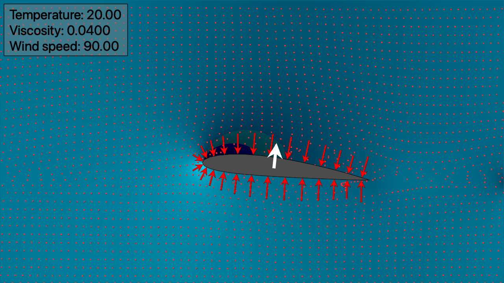

# DMCLBMMetal

This is a Swift implementation of a D2Q9 Lattice-Boltzmann fluid flow simulation.  It uses Metal to perform lattice collisions, streaming, edge force calculations, and tracer movement on a GPU; and to render depictions of the lattice state.

This package defines two products.

The `DMCLBMMetal` library models the flow of large collections of particles in a 2-dimensional space.  It also  creates QuickTime movies showing how the simulation evolves over time.

The `DMCLBMMetalSim` command line executable shows how these libraries can be used to run and record a simulation.

### TLA FTW

*`DMC` is meant to reduce the likelihood of name collisions with other Swift packages.  It's short for "[Desert Moon Consulting](https://dmoonc.com)," my software consulting LLC.*

*`LBM` stands for "Lattice-Boltzmann".*

## Motivation

A previous, CPU-based project implemented a [LatticeBoltzmann](https://github.com/mchapman87501/DMCLatticeBoltzmann.git) fluid flow simulation.  That code looked like a good jumping-off point for learning about GPU programming.

This isn't the first time I've tried to get up to speed with GPUs.  Most of my previous attempts have been disappointing.  One old project used [VisPy](https://vispy.org) and [OpenCL](https://www.khronos.org/opencl/) to model an n-body system, and it had tolerable performance.  But other attempts, all written for Apple Intel hardware, ran more slowly than corresponding CPU-based code.  Some were so badly written that they caused kernel panics.  😬

This time the results are much more satisfying.  On a 2021 MacBook Pro with an M1 Pro 10-CPU/16-GPU processor, this implementation runs 4 to 5 times faster than the [DMCLatticeBoltzmann](https://github.com/mchapman87501/DMCLatticeBoltzmann.git) from which it derives.

## Sources

This code owes a lot to Stack Overflow.  For example:

* https://stackoverflow.com/a/41574862
* https://stackoverflow.com/a/41574862/2826337

It also benefits from the explanations of these writers:

https://eugenebokhan.io/introduction-to-metal-compute-part-three

https://developer.apple.com/forums/thread/43570

[https://avinashselvam.medium.com](https://avinashselvam.medium.com):

* https://avinashselvam.medium.com/hands-on-metal-image-processing-using-apples-gpu-framework-8e530617276
* https://gist.github.com/avinashselvam/9ccdd297ce28a3363518727e50f77d11)

Since it is based on [DMCLatticeBoltzmann](https://github.com/mchapman87501/DMCLatticeBoltzmann.git), this code also draws on the same sources as that project:

https://softologyblog.wordpress.com/2017/03/28/more-fun-with-lattice-boltzman-method-lbm-fluid-simulations/

https://physics.weber.edu/schroeder/fluids/ and its links, including:

* https://physics.weber.edu/schroeder/fluids/FluidSimulationsForUndergrads.pdf
* http://physics.weber.edu/schroeder/javacourse/LatticeBoltzmann.pdf
* https://physics.weber.edu/schroeder/fluids/LatticeBoltzmannDemo.java.txt

https://homepages.abdn.ac.uk/jderksen/pages/lbm/ln02_lb.pdf

I probably missed a few references.  Check the source for more URLs.